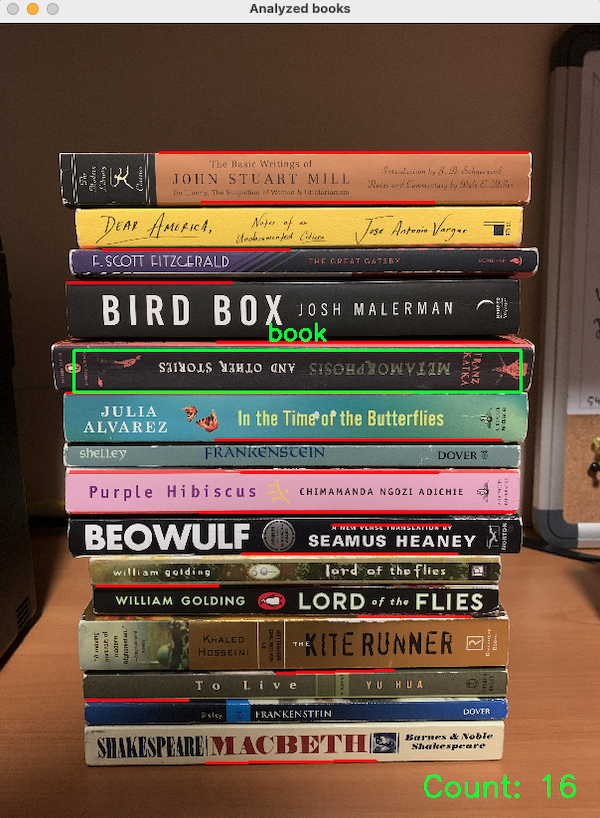
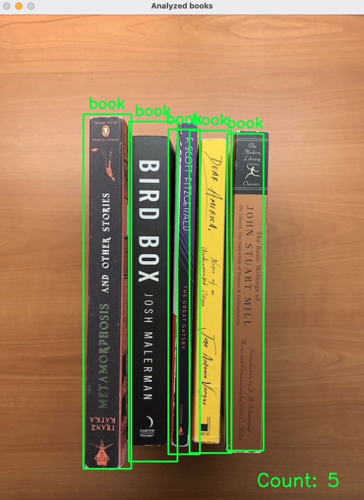
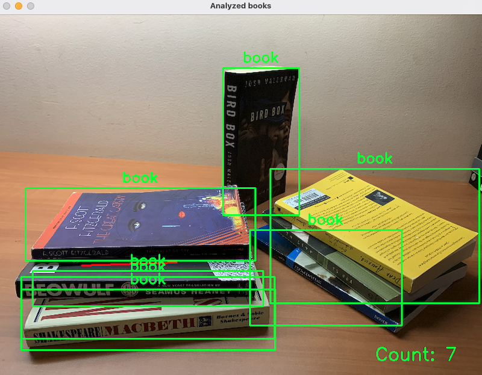
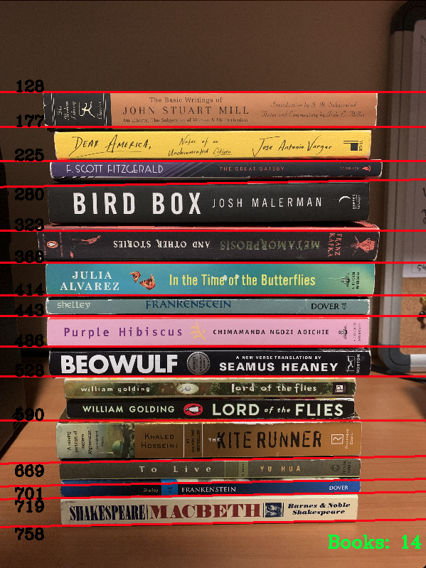

# Count books in an image using OpenCV and TensorFlow

This project uses TensorFlow Hub's CenterNet Object and Keypoints detection model trained on the COCO 2017 dataset, 
paired with OpenCV's Probablistic Hough Transform to count the number of books in an image.

## Running

`git clone https://github.com/nsortur/book-counter.git`

Install the following packages, then run `python3 count_books.py`
* numpy
* tensorflow
* tensorflow_hub (`pip install --upgrade tensorflow-hub`)
* cv2 (`pip install opencv-python`)

Make sure to have internet access so TensorFlow Hub can load the model

## Sample results
Horizontal             |  Vertical
:-------------------------:|:-------------------------:
  |  

## Previous model

The CenterNet model itself had low accuracy in counting stacked books from the side, so I combined it with my hough model and ensured no double counting. This provided far more accurate results from a variety of angles.
